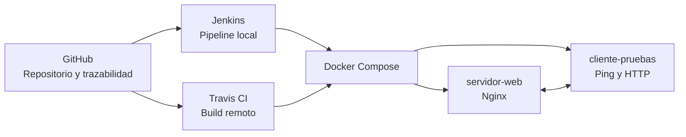

# Integración Continua — Proyecto Final

Repositorio académico público para el módulo **Énfasis Profesional I — Integración Continua**.

El proyecto consolida una solución incremental basada en **GitHub, Docker, Jenkins y Travis CI**. Su finalidad es demostrar control de cambios, construcción reproducible de servicios, validación de comunicación entre contenedores y automatización del flujo de integración continua.

> **Alcance verificado:** este repositorio contiene la configuración y documentación del proyecto. Las ejecuciones de Jenkins, Travis CI o CodeShip solo deben presentarse como exitosas cuando exista evidencia visible en su consola o dashboard.

## Arquitectura integrada



## Entregas consolidadas

| Entrega | Componente incorporado | Evidencia disponible |
|---|---|---|
| Entrega 1 | GitHub + Docker | Servicios `servidor-web` y `cliente-pruebas`, red Docker y script de comunicación. |
| Entrega 2 | Jenkins | `Jenkinsfile`, imagen Jenkins con Docker CLI, plugins y compose dedicado. |
| Entrega final | Travis CI + sustentación | `.travis.yml`, documentación final, matriz de evidencias y guion de sustentación. |

## Estructura principal

```text
.
├── README.md
├── Jenkinsfile
├── .travis.yml
├── docker-compose.yml
├── docker-compose.jenkins.yml
├── jenkins/
│   ├── Dockerfile
│   └── plugins.txt
├── servidor-web/
├── cliente-pruebas/
├── docs/
│   ├── entrega-2/
│   └── final/
│       ├── entrega-final.md
│       ├── instructivo-ejecucion-sustentacion.md
│       ├── matriz-evidencias.md
│       ├── guion-sustentacion.md
│       ├── roles-y-trazabilidad.md
│       └── codeship-estado.md
└── .github/workflows/
```

## Requisitos de ejecución

- Docker Desktop con contenedores Linux habilitados.
- Git.
- Navegador web.
- Para Jenkins: al menos 4 GB de RAM disponibles y 50 GB de almacenamiento recomendados para entornos pequeños, además de Java 21 incorporado en la imagen configurada.
- Cuenta de GitHub y, para evidencia remota, cuenta de Travis CI vinculada al repositorio.

## Ejecución local: Docker

Desde la raíz del repositorio:

```bash
docker compose build
docker compose up -d
docker compose ps
docker compose exec cliente-pruebas validar_comunicacion.sh
```

El servicio web queda disponible en:

```text
http://localhost:8080
```

Para detener el ambiente:

```bash
docker compose down
```

## Ejecución local: Jenkins

Primero crear la red y levantar los servicios base:

```bash
docker compose up -d
```

Luego construir e iniciar Jenkins:

```bash
docker compose -f docker-compose.jenkins.yml up -d --build
```

Consultar la contraseña inicial:

```bash
docker exec entrega2-jenkins cat /var/jenkins_home/secrets/initialAdminPassword
```

Abrir Jenkins:

```text
http://localhost:9090
```

En Jenkins, crear una tarea de tipo **Pipeline from SCM**, seleccionar este repositorio, rama `main` y archivo `Jenkinsfile`.

## Travis CI

El archivo `.travis.yml` define la construcción de imágenes, el inicio de los servicios y la validación de comunicación. Para obtener evidencia real:

1. Ingresar a Travis CI con GitHub.
2. Autorizar el acceso al repositorio público.
3. Activar `johan-zero/universidad-integracion-continua`.
4. Hacer un commit en `main` o ejecutar un build manual si la plataforma lo permite.
5. Capturar el resultado del build y los logs.

## Documentación final

- [Documento final](docs/final/entrega-final.md)
- [Instructivo de ejecución y sustentación](docs/final/instructivo-ejecucion-sustentacion.md)
- [Matriz de evidencias](docs/final/matriz-evidencias.md)
- [Guion de sustentación](docs/final/guion-sustentacion.md)
- [Roles y trazabilidad](docs/final/roles-y-trazabilidad.md)
- [Estado de CodeShip](docs/final/codeship-estado.md)

## Referencias técnicas

- [Documentación de Docker Compose](https://docs.docker.com/compose/)
- [Instalación de Jenkins con Docker](https://www.jenkins.io/doc/book/installing/docker/)
- [Pipelines definidos mediante Jenkinsfile](https://www.jenkins.io/doc/book/pipeline/jenkinsfile/)
- [Documentación de Travis CI](https://docs.travis-ci.com/)
