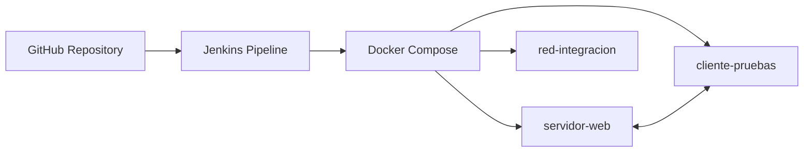

# Arquitectura de la solución - Entrega 2

La Entrega 2 incorpora Jenkins como capa de automatización sobre el repositorio GitHub y el ambiente Docker existente. La solución conserva el trabajo de la Entrega 1 y agrega un pipeline versionado mediante `Jenkinsfile`.

## Flujo técnico

| Paso | Componente | Resultado |
|---|---|---|
| 1 | GitHub | Aloja código, documentación y Jenkinsfile. |
| 2 | Jenkins | Ejecuta pipeline declarativo. |
| 3 | Docker Compose | Construye e inicia servicios. |
| 4 | Cliente de pruebas | Valida comunicación hacia servidor-web. |

## Archivos clave

- `Jenkinsfile`: define las etapas del pipeline.
- `docker-compose.jenkins.yml`: despliega Jenkins en Docker.
- `docker-compose.yml`: conserva los servicios base de la Entrega 1.
- `cliente-pruebas/validar_comunicacion.sh`: ejecuta la validación interna.
