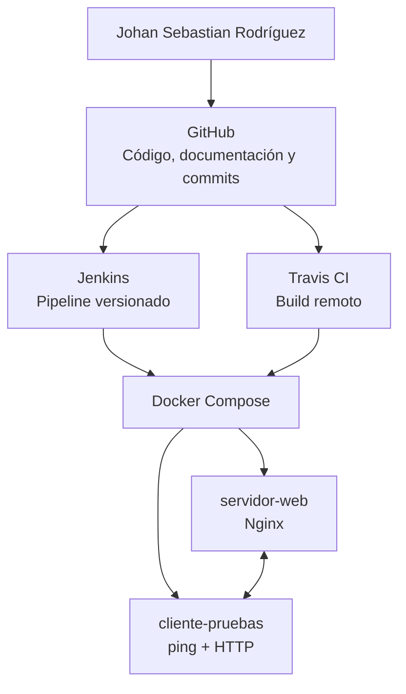

# Entrega final — Integración Continua

**Estudiante:** Johan Sebastian Rodríguez

## Resumen ejecutivo

Este proyecto consolida la implementación individual de un flujo de integración continua para un servicio web simple. La solución utiliza GitHub como repositorio y mecanismo de trazabilidad, Docker Compose para construir y ejecutar servicios aislados, Jenkins como gestor de operaciones local y Travis CI como configuración de validación remota ante cambios en la rama principal.

La entrega final preserva las evidencias técnicas de las etapas anteriores y responde a la retroalimentación de la segunda entrega mediante una especificación más completa de los requisitos de Jenkins, la documentación del pipeline y una matriz de evidencias para la sustentación individual.

## 1. Objetivo

Demostrar un flujo integrado de control de cambios, construcción, ejecución y validación de servicios mediante GitHub, Docker, Jenkins y Travis CI, manteniendo trazabilidad de los cambios y evidencia verificable de cada herramienta.

## 2. Arquitectura de la solución

La arquitectura separa la responsabilidad de cada herramienta. GitHub mantiene el código fuente, los commits y los archivos de automatización. Docker Compose declara el ambiente de ejecución. Jenkins utiliza el `Jenkinsfile` para validar localmente el proyecto. Travis CI consume `.travis.yml` para ejecutar el mismo flujo sobre cambios en `main`.

## 3. Implementación consolidada

| Componente | Implementación | Evidencia en el repositorio |
|---|---|---|
| Control de cambios | Repositorio público y rama `main`. | `README.md`, historial de commits y archivos versionados. |
| Contenedores | Dos servicios comunicados por una red Docker. | `docker-compose.yml`, `servidor-web/`, `cliente-pruebas/`. |
| Validación funcional | El cliente ejecuta ping y una solicitud HTTP al servidor. | `cliente-pruebas/validar_comunicacion.sh`. |
| Automatización local | Pipeline declarativo para construir, iniciar y validar. | `Jenkinsfile`. |
| Jenkins en Docker | Imagen con Java 21, Docker CLI, Compose y plugins requeridos. | `jenkins/Dockerfile`, `jenkins/plugins.txt`, `docker-compose.jenkins.yml`. |
| Automatización remota | Configuración de build para Travis CI. | `.travis.yml`. |

## 4. Requisitos de Jenkins y justificación

La instalación de Jenkins se define como contenedor para mantener un entorno reproducible. La imagen usa JDK 21 e incorpora Docker CLI y Docker Compose Plugin, necesarios para que el pipeline pueda invocar los comandos definidos en el proyecto. El archivo `plugins.txt` declara Git, GitHub, Pipeline y Docker Pipeline; estos componentes permiten leer el repositorio y ejecutar el pipeline declarativo.

| Requisito | Justificación |
|---|---|
| Docker Desktop en modo Linux Containers | Ejecuta el ambiente de servicios y el contenedor de Jenkins. |
| 4 GB de RAM y 50 GB de almacenamiento recomendados | Base de capacidad para un entorno individual de baja escala. |
| Puerto 9090 | Expone la interfaz de Jenkins sin colisionar con el puerto 8080 del servidor web. |
| Puerto 50000 | Reserva la comunicación con agentes Jenkins cuando sea necesaria. |
| Volumen `jenkins_home` | Conserva configuración, usuario y datos del controlador entre reinicios. |
| Socket Docker | Permite al pipeline administrar el ambiente Compose del host. |
| Plugins Git, GitHub, Pipeline y Docker Pipeline | Soportan control de código, ejecución del pipeline y automatización Docker. |

El acceso al socket Docker debe usarse únicamente en entornos de desarrollo controlados, debido a que otorga permisos elevados sobre el host. Las credenciales no deben incluirse en el repositorio; Jenkins y Travis CI deben gestionarlas mediante sus mecanismos de credenciales o variables protegidas.

## 5. Flujo de validación

El `Jenkinsfile` declara cuatro etapas: validación de disponibilidad del proyecto, construcción de imágenes, inicio de los servicios y validación de comunicación. La última etapa ejecuta el script ubicado en el contenedor `cliente-pruebas`; el script verifica resolución de nombre y disponibilidad HTTP del servicio `servidor-web`.

El archivo `.travis.yml` replica la lógica esencial del flujo para la rama `main`: construye imágenes, inicia servicios, consulta su estado y ejecuta la validación. Esta equivalencia permite que el mismo criterio funcional se aplique de manera local mediante Jenkins y remota mediante Travis CI.

## 6. Trazabilidad y control de cambios

El repositorio conserva los artefactos que permiten revisar la evolución del proyecto: Dockerfiles, archivos Compose, `Jenkinsfile`, `.travis.yml` y documentos finales. Cada cambio se acompaña de un commit descriptivo, por ejemplo: `ci: agregar configuracion Travis CI` o `docs: consolidar entrega final`.

Para una revisión completa, la sustentación debe mostrar el historial de commits, los archivos de automatización y, cuando exista, una rama o pull request asociado a cambios relevantes.

## 7. Evidencias requeridas

La entrega debe incluir evidencia real y legible de los siguientes elementos:

1. Repositorio público y archivos principales.
2. Servicios Docker activos mediante `docker compose ps`.
3. Resultado de `validar_comunicacion.sh`.
4. Jenkins iniciado en `http://localhost:9090`.
5. Plugins y tarea Pipeline configurada en Jenkins.
6. Consola de ejecución del pipeline.
7. Archivo `.travis.yml` y repositorio activado en Travis CI.
8. Resultado del build de Travis CI.
9. Historial de commits, decisiones técnicas y reflexión individual.

Cada figura debe incluir número, título, explicación breve y la fuente **Elaboración propia**.

## 8. Estado de CodeShip

La guía del módulo solicita mencionar CodeShip dentro del entorno integrado. Sin embargo, CodeShip solo puede declararse como implementado cuando exista acceso a la plataforma, repositorio vinculado y build verificable. Mientras no exista esa evidencia, la sustentación debe indicar de forma transparente que se documentó la verificación de disponibilidad y que la herramienta requiere confirmación o autorización del tutor para usar una alternativa vigente. Véase [estado de CodeShip](codeship-estado.md).

## 9. Conclusiones

- GitHub proporciona trazabilidad del código, la documentación y las decisiones del proyecto.
- Docker Compose ofrece un ambiente reproducible para ejecutar servicios aislados y comunicados.
- Jenkins permite automatizar validaciones locales mediante un pipeline versionado.
- Travis CI extiende la validación al flujo remoto asociado a cambios en el repositorio.
- La evidencia diferencia claramente entre configuración implementada y ejecución comprobada, evitando declarar resultados sin una consola o dashboard verificable.

## Referencias

Docker. (s. f.). *Docker Compose documentation*. https://docs.docker.com/compose/

Jenkins. (s. f.). *Installing Jenkins using Docker*. https://www.jenkins.io/doc/book/installing/docker/

Jenkins. (s. f.). *Using a Jenkinsfile*. https://www.jenkins.io/doc/book/pipeline/jenkinsfile/

Travis CI. (s. f.). *Travis CI documentation*. https://docs.travis-ci.com/
